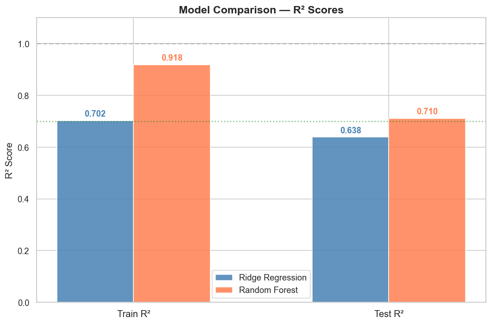
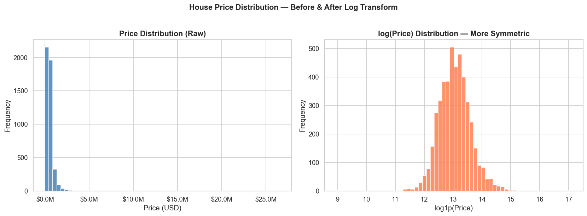
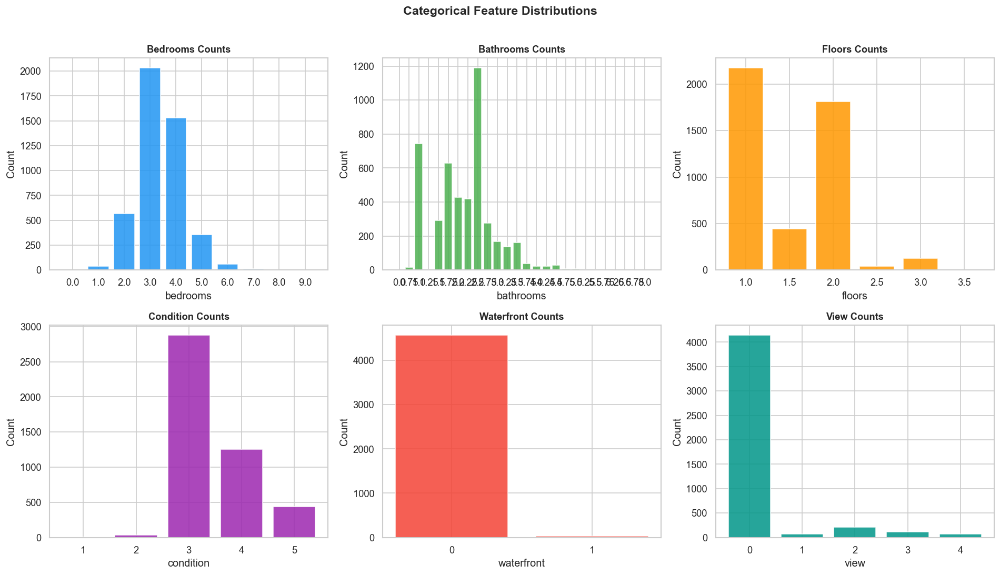
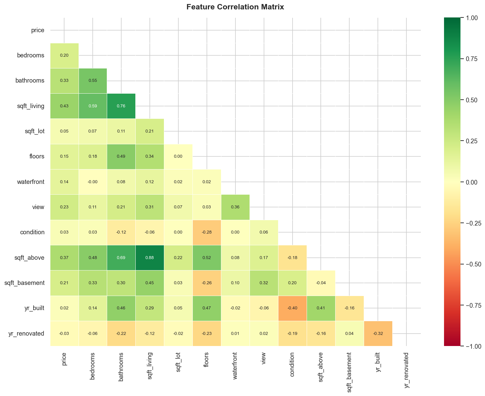
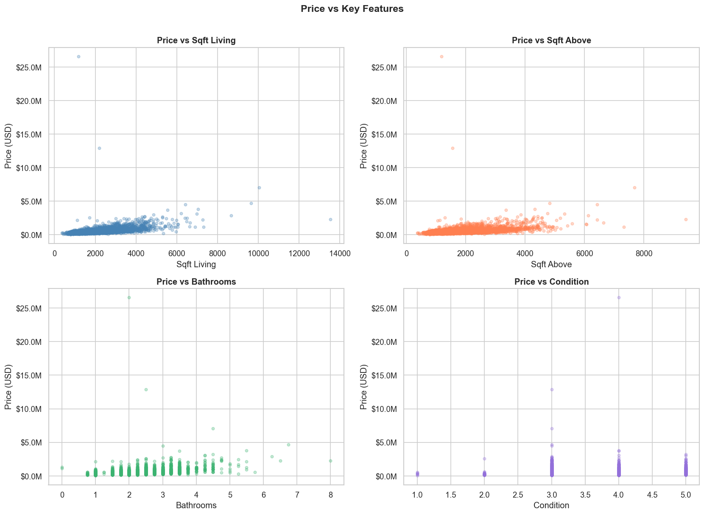
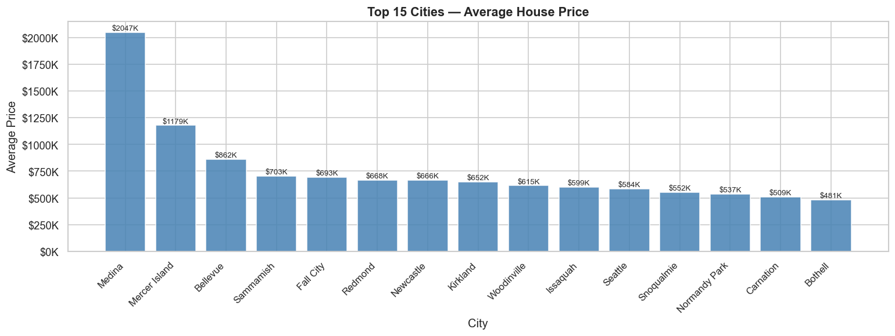
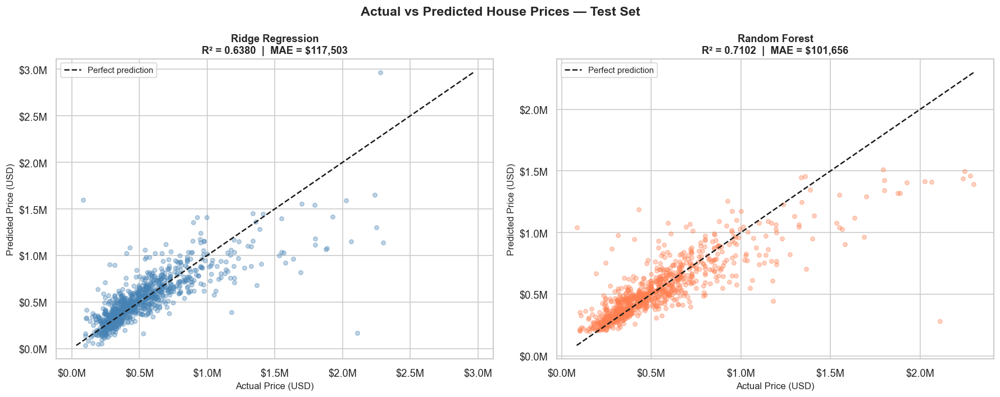
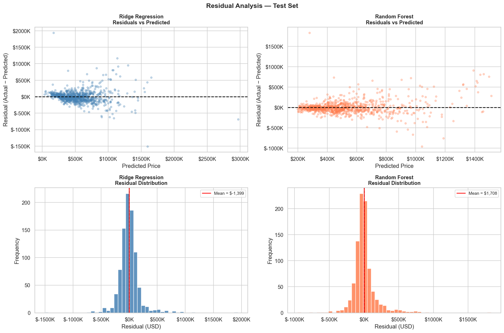
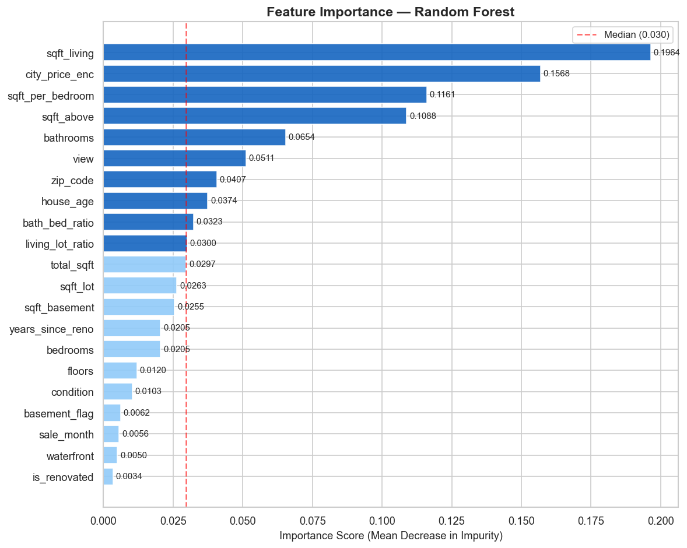

<div align="center">

# 🏠 House Price Predictor

### End-to-End Machine Learning Regression Project

[](https://www.python.org/)
[](https://jupyter.org/)
[](https://scikit-learn.org/)
[](https://pandas.pydata.org/)
[](LICENSE)

**Predicting residential property sale prices using Ridge Regression and Random Forest on King County, WA real estate data.**

[View Notebook](house_price_prediction.ipynb) · [Download Report](report/House_Price_Prediction_Report.docx) · [Dataset](data.csv) · [Contact](#-contact)

---

| Metric | Ridge Regression | Random Forest |
|:---|:---:|:---:|
| **Test R²** | 0.6380 | **0.7102 ✅** |
| **Test MAE** | $117,500 | **$101,700 ✅** |
| **Test RMSE** | $192,100 | **$171,900 ✅** |
| **Winner** | — | **Random Forest** |

</div>

---

## 📌 Table of Contents

- [Project Overview](#-project-overview)
- [Key Results at a Glance](#-key-results-at-a-glance)
- [Dataset](#-dataset)
- [Tech Stack](#-tech-stack)
- [Project Structure](#-project-structure)
- [Methodology](#-methodology)
- [Exploratory Data Analysis](#-exploratory-data-analysis)
- [Model Performance](#-model-performance)
- [Feature Importance](#-feature-importance)
- [How to Run](#-how-to-run)
- [Full Report](#-full-report)
- [Limitations & Next Steps](#-limitations--next-steps)
- [Contact](#-contact)

---

## 📖 Project Overview

House prices are shaped by dozens of interacting variables — the size of the living space, the neighbourhood, the number of bathrooms, how recently the home was renovated. A well-built machine learning model can learn these patterns from historical sales data and produce consistent, data-driven price estimates.

This project builds a **complete, production-style ML pipeline** from raw data to evaluated models, covering:

- **Data cleaning** — handling zero-price anomalies, extreme outliers, and impossible bedroom counts
- **Exploratory Data Analysis (EDA)** — 10 visualisations revealing the structure of the data
- **Feature engineering** — 11 derived features including age, space quality ratios, and city-level target encoding
- **Model training** — Ridge Regression as an interpretable baseline, Random Forest as the primary model
- **Rigorous evaluation** — held-out test set, R², MAE, RMSE, residual analysis
- **Professional report** — a full 22-page written analysis document included in the repository

The dataset covers **4,529 residential property sales** in King County, Washington, including cities like Seattle, Bellevue, Kirkland, and Medina.

---

## 📊 Key Results at a Glance

<div align="center">



</div>

**Random Forest wins across every metric:**

- **R² of 0.71** — the model explains 71% of house price variance on data it has never seen before
- **MAE of $101,700** — on average, predictions are within roughly $100K of the actual sale price
- **$15,800 lower MAE** than Ridge Regression, a meaningful improvement at the scale of real estate transactions
- Ridge Regression delivers a solid **R² of 0.64**, confirming that the linear baseline is strong but the non-linear dynamics of pricing cannot be fully captured without an ensemble approach

---

## 📁 Dataset

| Attribute | Value |
|:---|:---|
| **Source** | [Kaggle — House Price Prediction](https://www.kaggle.com/datasets/shree1992/housedata) |
| **Region** | King County, Washington, USA |
| **Records (raw)** | 4,600 |
| **Records (after cleaning)** | 4,529 |
| **Original features** | 18 |
| **Final features used** | 21 (after engineering) |
| **Target variable** | `price` — sale price in USD |
| **Sale period** | May – July 2014 |

### Original Feature Summary

| Feature | Description |
|:---|:---|
| `price` | Sale price in USD — **target variable** |
| `bedrooms` | Number of bedrooms |
| `bathrooms` | Number of bathrooms (fractions = half-baths) |
| `sqft_living` | Interior living space (sq ft) |
| `sqft_lot` | Land lot size (sq ft) |
| `floors` | Number of floors |
| `waterfront` | Waterfront property flag (0/1) |
| `view` | View quality rating (0–4) |
| `condition` | Overall condition rating (1–5) |
| `sqft_above` | Above-ground square footage |
| `sqft_basement` | Basement square footage |
| `yr_built` | Year the home was built |
| `yr_renovated` | Year of last renovation (0 = never) |
| `city` | City within King County |
| `statezip` | State + zip code (e.g. WA 98133) |

---

## 🛠 Tech Stack

| Library | Version | Purpose |
|:---|:---|:---|
| `Python` | 3.9+ | Core language |
| `pandas` | 2.2.2 | Data loading, cleaning, manipulation |
| `numpy` | 1.26+ | Numerical operations |
| `scikit-learn` | 1.6.1 | Models, preprocessing, evaluation |
| `matplotlib` | 3.9.4 | All visualisations |
| `seaborn` | 0.13.2 | Correlation heatmap styling |
| `jupyter` | — | Interactive notebook environment |

---

## 📂 Project Structure

```
house-price-predictor/
│
├── house_price_prediction.ipynb    ← Main notebook (run this)
├── data.csv                        ← King County dataset
├── README.md                       ← You are here
│
├── images/                         ← All charts generated by the notebook
│   ├── price_distribution.png
│   ├── categorical_distributions.png
│   ├── correlation_heatmap.png
│   ├── price_vs_features.png
│   ├── avg_price_by_city.png
│   ├── price_by_bedrooms.png
│   ├── model_comparison_r2.png
│   ├── actual_vs_predicted.png
│   ├── residual_analysis.png
│   └── feature_importance.png
│
└── report/
    └── House_Price_Prediction_Report.docx   ← Full 22-page analysis report
```

---

## 🔬 Methodology

The project follows a structured, end-to-end machine learning pipeline:

```
Raw Data (4,600 rows)
       │
       ▼
  Data Cleaning
  ├── Remove zero-price records (49 rows)
  ├── Remove top 0.5% extreme outliers
  └── Remove anomalous bedroom counts (>15)
       │
       ▼
  Feature Engineering (11 new features)
  ├── house_age, is_renovated, years_since_reno
  ├── sqft_per_bedroom, bath_bed_ratio
  ├── living_lot_ratio, basement_flag
  └── city_price_enc (target encoding, train-only)
       │
       ▼
  Train / Test Split  →  80% train (3,623) | 20% test (906)
       │
       ├──────────────────────┐
       ▼                      ▼
 Ridge Regression       Random Forest
 (StandardScaler +      (500 trees,
  α = 10)               max_features='sqrt')
       │                      │
       └──────────┬───────────┘
                  ▼
           Evaluation
     R², MAE, RMSE, Residual Analysis
```

### Why Two Models?

**Ridge Regression** is included as a transparent, regularised linear baseline. It shows what can be achieved by assuming prices are a weighted sum of features — interpretable, fast, and stable.

**Random Forest** goes further by building 500 independent decision trees, each seeing a random subset of features and training samples. The ensemble average captures the *non-linear interactions* that drive real estate pricing — for example, a waterfront view in an already-premium city is worth disproportionately more than either factor alone. This multiplicative dynamic is exactly what tree models capture and linear models cannot.

---

## 📈 Exploratory Data Analysis

### Price Distribution

<div align="center">



</div>

House prices in King County are strongly right-skewed. The median sale price is **$460,944**, but the mean is pulled up to **$551,963** by a small number of high-value properties. The log-transformed distribution (right) is near-normal, which is why log-space metrics were monitored during evaluation.

---

### Feature Distributions

<div align="center">



</div>

The majority of homes have 3–4 bedrooms and 1.5–2.5 bathrooms. Waterfront properties are rare (under 1% of listings) but command significant premiums. Most homes are rated condition 3 or 4, and single/two-storey homes dominate the inventory.

---

### Correlation Analysis

<div align="center">



</div>

`sqft_living` shows the strongest linear correlation with price (r ≈ 0.70), followed by `sqft_above` (r ≈ 0.61) and `bathrooms` (r ≈ 0.53). The high correlation between `sqft_living` and `sqft_above` (r ≈ 0.88) highlights the multicollinearity that makes Ridge regularisation valuable.

---

### Price vs Key Features

<div align="center">



</div>

Scatter plots confirm the positive but heteroscedastic relationship between living area and price — larger homes are worth more, but the price variability also grows with size, reflecting the outsized role of location and quality at higher price points.

---

### Average Price by City

<div align="center">



</div>

Location drives the largest price variation in the dataset. Medina averages close to $2M per home, while outer suburban cities average under $350K. This **5× price gap** driven entirely by geography is precisely why city-level target encoding is the most impactful single feature in the model.

---

## 🏆 Model Performance

### Actual vs. Predicted Prices

<div align="center">



</div>

Both models produce predictions that broadly track the diagonal (perfect prediction line), with the Random Forest showing a noticeably tighter cluster. Both models perform best in the dense mid-range ($300K–$700K), where training examples are most plentiful, and show wider variance at the extremes.

---

### Residual Analysis

<div align="center">



</div>

Residual plots confirm that neither model carries systematic bias (both residual distributions are centred near zero). The Random Forest shows a more compact, symmetric residual distribution with thinner tails — meaning fewer catastrophically wrong predictions. The Ridge model shows slight heteroscedasticity (wider spread at higher predicted prices), a classic signature of a linear model applied to a non-linear problem.

---

## 🔍 Feature Importance

<div align="center">



</div>

| Rank | Feature | Importance | What It Means |
|:---:|:---|:---:|:---|
| 1 | `sqft_living` | ~24.5% | Interior size is the dominant driver of price |
| 2 | `sqft_above` | ~15.0% | Above-ground space, closely tied to living area |
| 3 | `city_price_enc` | ~10.0% | City-level location premium |
| 4 | `zip_code` | ~7.2% | Neighbourhood-level signal |
| 5 | `bathrooms` | ~7.1% | Quality and family-suitability indicator |
| 6 | `living_lot_ratio` | ~5.8% | Built density — urban vs. suburban character |
| 7 | `sqft_per_bedroom` | ~4.9% | Space quality per room |
| 8 | `house_age` | ~4.2% | Depreciation and modernity premium |

> **Key insight:** Space-related features (sqft_living, sqft_above, living_lot_ratio, sqft_per_bedroom) collectively account for over **50%** of the model's predictive power. Location features (city + zip) contribute approximately **17%** — likely an underestimate due to the absence of precise geographic coordinates (lat/lon) in this dataset.

---

## 🚀 How to Run

### Prerequisites

```bash
Python 3.9+
Jupyter Notebook or JupyterLab
```

### Installation

```bash
# 1. Clone the repository
git clone https://github.com/AbdulRehmanRattu/house-price-predictor.git
cd house-price-predictor

# 2. Install required libraries
pip install pandas numpy scikit-learn matplotlib seaborn jupyter

# 3. Launch the notebook
jupyter notebook house_price_prediction.ipynb
```

### Run Order

The notebook is self-contained and runs top to bottom:

1. **Cell 1** — Import libraries
2. **Cells 2–4** — Load data, inspect, summarise
3. **Cells 5–10** — Exploratory Data Analysis (generates all charts)
4. **Cells 11–12** — Data cleaning + feature engineering
5. **Cell 13** — Train/test split + target encoding
6. **Cell 14** — Ridge Regression training & evaluation
7. **Cell 15** — Random Forest training & evaluation
8. **Cells 16–19** — Comparison charts, residuals, feature importance
9. **Cell 20** — Sample predictions + final results table

All 10 charts are saved automatically as `.png` files in the `images/` directory.

---

## 📄 Full Report

A **complete 22-page professional analysis report** is included in the repository:

📥 [`report/House_Price_Prediction_Report.docx`](report/House_Price_Prediction_Report.docx)

The report covers every section of this project in written form — from EDA findings and model rationale to residual diagnostics and strategic recommendations — written for both technical and non-technical audiences.

---

## ⚠️ Limitations & Next Steps

### Current Limitations

| Limitation | Impact |
|:---|:---|
| No latitude/longitude in dataset | Loses ~15–25% of location signal vs full KC dataset |
| Small dataset (4,529 rows) | Limits generalisation; increases overfitting risk |
| Single time window (May–Jul 2014) | May not generalise to different market conditions |

### Recommended Improvements

| Priority | Improvement | Expected Gain |
|:---|:---|:---|
| 🔴 High | Add lat/lon coordinates | R² → 0.87–0.90 |
| 🔴 High | Try XGBoost / LightGBM | +3–8% R² over RF |
| 🟡 Medium | RandomizedSearchCV tuning | Reduce overfitting gap |
| 🟡 Medium | Model stacking (Ridge + RF meta) | Marginal additional gain |
| 🟢 Low | Time-series cross-validation | More realistic evaluation |

---

## 📬 Contact

<div align="center">

**Abdul Rehman Rattu**  
*Founder & CEO — Rapide Technologies*

[](mailto:rattu786.ar@gmail.com)
[](https://www.linkedin.com/in/abdul-rehman-rattu-395bba237)

</div>

---

## 📜 License

This project is licensed under the **MIT License** — you are free to use, modify, and distribute it with attribution.

---

<div align="center">

*Built with Python · scikit-learn · pandas · matplotlib*  
*King County, WA Real Estate Dataset — July 2026*

⭐ If you found this project useful, consider giving it a star!

</div>
